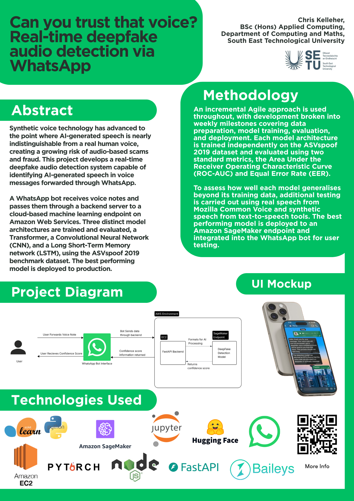

# Deepfake Voice Detection System

Final Year Project — AI-Based Synthetic Speech Detection Platform

---

## Navigation

| Section | Link |
|---|---|
| Live Demo | [Open Demo](demo.html) |
| Full Technical Report | [View Report PDF](FYP-Semester-2-Report-20101947-ChrisKelleher.pdf) |
| Project Architecture | [ProjectArchitecture.md](ProjectArchitecture.md) |
| Project Timeline | [ProjectPlanTimeline.md](ProjectPlanTimeline.md) |
| Dataset Exploration | [DatasetExploration.md](DatasetExploration.md) |
| Wav2Vec2 Training | [Wav2Vec2Training.md](Wav2Vec2Training.md) |
| LSTM Development | [LSTMDevelopment.md](LSTMDevelopment.md) |
| CNN14 PANNs Model | [CNN14Model.md](CNN14Model.md) |
| Evaluation Results | [Evaluation.md](Evaluation.md) |
| System Evaluation | [SystemEvaluation.md](SystemEvaluation.md) |
| Future Work | [FutureWork.md](FutureWork.md) |
| Glossary | [Glossary.md](Glossary.md) |
| References | [References.md](References.md) |

---

## Project Overview

This project presents the design, training, evaluation, and deployment of an AI-driven deepfake voice detection system capable of identifying synthetic speech from real human speech.

The system combines:

- Deep learning-based audio classification
- Cloud-hosted inference
- A WhatsApp chatbot interface
- A browser-based testing platform
- Real-time backend processing

The primary objective was to investigate whether modern speech models could be integrated into widely used communication platforms to provide accessible deepfake voice detection for real-world users.

---

## System Poster

---

# Repository

GitHub Pages Repository:

https://github.com/ChrisKelleher1947/ChrisKelleher1947.github.io

---

## Live Demonstration

The deployed web interface allows users to upload audio files and receive a prediction indicating whether the audio is likely genuine or synthetic.

### Open the Live Demo

<a href="demo.html">
    <button>Launch Demo</button>
</a>

### Recommended Audio

Best performance is achieved with:

- High-quality microphone recordings
- Minimal background noise
- WAV or high bitrate audio

Performance may degrade with:

- WhatsApp voice notes
- Heavy compression
- Low bitrate recordings
- Excessive background noise

---

# Project Sections

---

## 1. Dataset Exploration

The project began with a full exploration of the ASVspoof 2019 Logical Access dataset.

### Topics Covered

- Dataset structure
- Label analysis
- Waveform visualisation
- Log-Mel spectrogram analysis
- Class imbalance inspection

### Included Analysis

- Real vs fake waveform comparison
- Spectrogram comparisons
- Audio distribution analysis
- Frequency-domain inspection

### View Section

[Open Dataset Exploration](DatasetExploration.md)

---

## 2. Wav2Vec2 Training Pipeline

The primary model used in this project was a fine-tuned Wav2Vec2 transformer architecture.

### Pipeline Components

- GPU configuration
- Dataset loading
- Multi-source integration
- Audio preprocessing
- Augmentation pipeline
- Feature extraction
- Fine-tuning strategy
- Weighted sampling
- Optimisation setup
- Training loop implementation

### Key Features

- Raw waveform learning
- Transfer learning
- Mixed precision training
- Opus codec simulation
- FFmpeg preprocessing
- Early stopping
- ROC-AUC evaluation

### View Section

[Open Wav2Vec2 Training](Wav2Vec2Training.md)

---

## 3. LSTM Model Development

A bidirectional LSTM architecture was implemented as a secondary comparison model.

### Features

- Mel-spectrogram inputs
- Sequential modelling
- Bidirectional processing
- Spectrogram preprocessing
- Recurrent neural network classification

### Included Topics

- Spectrogram generation
- Dataset adaptation
- LSTM architecture design
- Training configuration
- Evaluation pipeline

### View Section

[Open LSTM Development](LSTMDevelopment.md)

---

## 4. CNN14 PANNs Model

The CNN14 architecture from the PANNs framework was implemented as a convolutional baseline model.

### Features

- Time-frequency feature extraction
- Mel-spectrogram input representation
- CNN feature learning
- Efficient training pipeline

### Included Topics

- Spectrogram preprocessing
- CNN input formatting
- Forward pass implementation
- Loss calculation
- Evaluation pipeline

### View Section

[Open CNN14 Model](CNN14Model.md)

---

## 5. Model Evaluation

All models were evaluated using identical preprocessing pipelines and evaluation metrics to ensure fair comparison.

### Evaluation Metrics

- Loss
- Accuracy
- ROC-AUC
- Classification performance
- Training convergence

### Models Evaluated

| Model | Input Type | Performance |
|---|---|---|
| Wav2Vec2 | Raw waveform | Highest overall |
| CNN14 | Spectrogram | Strong balance |
| LSTM | Spectrogram | Competitive baseline |

### Included Graphs

- Loss curves
- Accuracy curves
- ROC-AUC curves
- Comparative model analysis

### View Section

[Open Evaluation Results](Evaluation.md)

---

## 6. System Evaluation

The complete end-to-end system was evaluated under real-world conditions.

### Components Evaluated

- WhatsApp chatbot
- Web upload system
- FastAPI backend
- AWS deployment
- Audio preprocessing pipeline

### Key Findings

- Strong performance on high-quality audio
- Significant degradation on compressed WhatsApp audio
- Compression artefacts heavily affect classification accuracy
- Windowing improves robustness on long-form audio

### View Section

[Open System Evaluation](SystemEvaluation.md)

---

## 7. Cloud System Architecture

The deployed system uses a distributed cloud architecture.

## Architecture Components

| Component | Purpose |
|---|---|
| WhatsApp Bot | User interaction |
| FastAPI Backend | Audio processing |
| AWS EC2 | Backend hosting |
| SageMaker | Model inference |
| FFmpeg | Audio conversion |

---

## System Architecture Diagram

---

## 8. Training Pipeline

The AI training workflow follows a structured deep learning pipeline.

### Pipeline Stages

1. Dataset loading
2. Audio preprocessing
3. Data augmentation
4. Feature extraction
5. Model training
6. Validation and evaluation
7. Model selection
8. Deployment

---

## 9. Real-World Challenges

The project identified several major deployment challenges.

### Primary Limitation

WhatsApp voice compression introduces severe audio degradation through the Opus codec.

### Effects on Performance

- Loss of high-frequency speech information
- Reduced waveform fidelity
- Increased false positives
- Lower generalisation performance

### Additional Challenges

- Environmental noise
- Low-quality microphones
- Packet loss
- Variable bitrate encoding

---

## 10. Future Improvements

Several future improvements were identified during evaluation.

### Planned Enhancements

- Increased real-world training data
- More aggressive codec simulation
- Domain adaptation techniques
- Adversarial training
- Official WhatsApp Business API integration
- Real-time call analysis
- Improved explainability tools

### View Section

[Open Future Work](FutureWork.md)

---

# Technologies Used

| Technology | Purpose |
|---|---|
| Python | Core development |
| PyTorch | Deep learning framework |
| Hugging Face Transformers | Wav2Vec2 implementation |
| Torchaudio | Audio processing |
| FFmpeg | Audio conversion |
| FastAPI | Backend API |
| AWS EC2 | Hosting |
| AWS SageMaker | Model deployment |
| Node.js | WhatsApp integration |
| WhatsApp-Web.js | Chatbot interface |

---

# Experimental Methodology

To ensure scientifically valid comparison between models:

- Identical datasets
- Identical train/validation splits
- Identical preprocessing
- Identical augmentation strategy
- Identical evaluation metrics

The only changing variable between experiments was the model architecture.

---

# Key Findings

| Finding | Outcome |
|---|---|
| Wav2Vec2 performance | Best overall |
| CNN14 performance | Strong balance of speed and accuracy |
| LSTM performance | Competitive despite simplicity |
| Spectrogram models | Effective but less robust |
| Compression handling | Major weakness |
| Real-world deployment | Challenging due to audio degradation |

---

# Conclusion

This project successfully demonstrates the feasibility of integrating deep learning-based synthetic speech detection into real-world communication systems.

The implemented platform combines:

- Deep learning audio classification
- Cloud-hosted inference
- Messaging platform integration
- Real-time processing

While strong performance was achieved on high-quality audio, the project also highlights the difficulty of detecting synthetic speech in heavily compressed real-world environments.

The system provides a strong foundation for future research into practical and scalable deepfake voice detection technologies.

---

# Additional Pages

| Page | Description |
|---|---|
| [ProjectArchitecture.md](ProjectArchitecture.md) | Cloud system architecture |
| [ProjectPlanTimeline.md](ProjectPlanTimeline.md) | Semester timeline |
| [DatasetExploration.md](DatasetExploration.md) | Dataset analysis |
| [Wav2Vec2Training.md](Wav2Vec2Training.md) | Transformer training pipeline |
| [LSTMDevelopment.md](LSTMDevelopment.md) | LSTM implementation |
| [CNN14Model.md](CNN14Model.md) | CNN14 architecture |
| [Evaluation.md](Evaluation.md) | Model evaluation |
| [SystemEvaluation.md](SystemEvaluation.md) | Real-world testing |
| [FutureWork.md](FutureWork.md) | Planned improvements |
| [Glossary.md](Glossary.md) | Technical terminology |
| [References.md](References.md) | Academic references |

---
