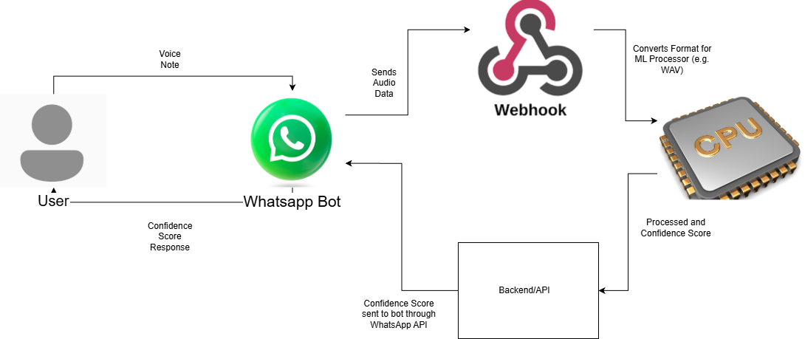
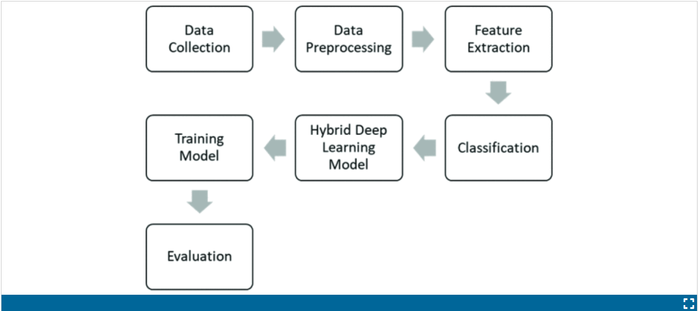

# FYP-Pages
Final Year Project GitHub Pages Repo

# Page Directory
[Project Architecture](ProjectArchitecture.md)

[Project Timeline Semester 2](ProjectPlanTimeline.md)
<h2>Live Demo</h2>

Try the deepfake detection model in action:

<a href="demo.html">
    <button>Launch Demo</button>
</a>

# Model Selection
| Model       | Pretrained Base            | Fine-tune Target                                 |
| ----------- | -------------------------- | ------------------------------------------------ |
| Transformer | `Gustking/wav2vec2`        | Top layers + classification head                 |
| CNN         | `PANNs cnn14`              | Replace dense output, fine-tune last conv blocks |
| LSTM        | `OpenL3 embeddings → LSTM` | Train LSTM + final dense layer                   |

# Deepfake Detection Flow

The above diagram shows the proposed flow for this project. The backend will only be for receiving a POST from a webhook and will send that to the LLM. This returns a confidence score and the backend application sends this to the WhatsApp bot via the WhatsApp API.

I propose to use something like FastAPI, a Python-based backend framework.

Below is a useful YouTube video outlining how the backend may send a request to the LLM using FastAPI. Perhaps if the AI is trained to take in these prompts and output the confidence score, this video contains most of the info on how to complete the backend side of this process. I will then also need to configure the response being automatically sent to the WhatsApp API for the chatbot.  
[External link to youtube.com](https://www.youtube.com/watch?v=cy6EAp4iNN4)

The WhatsApp Cloud API documentation link below offers useful information and guides for how to set up both webhooks and a chatbot for free as long as it is in a testing capacity. This should work well for this project as the number of actual requests will be small, and it will allow me to build and show the proof of concept for the project without needing to incur costs.  
[External link to developers.facebook.com](https://developers.facebook.com/docs/whatsapp/cloud-api)

[External link to Artificial Intelligence to Combat Audio Fraud: A Flask-Deployed Hybrid Deep Learning System](https://ieeexplore.ieee.org/document/10778737)  
Found that RNN or Recurrent Neural Networks were the most accurate type of neural network for synthetic speech detection. Used ASVSpoof2019, potential training dataset for this project.  
They used the below diagram in experiment setup, useful to keep:  
  
Audio is sequential data, data over time, best suited to RNN. Each AI model performed within 1% of each other however. Does not specify the type of RNN used (LSTM or Long Short-Term Memory for example). They also built an API using Flask showing users able to upload an audio file and get a result of real or fake back. Not a confidence score and not a chatbot, but clear the API call prompts for the model to predict audio will work in some capacity, no specifics given.

[External link to IBM What is a recurrent neural network? by Cole Stryker](https://www.ibm.com/think/topics/recurrent-neural-networks)  
ChatGPT is an example of an RNN. This is an AI that takes past inputs and can then make predictions and conclusions based on those inputs. Example would be for language translation. Taking speech patterns and predicting what the next word should be. Described as being good at taking previous sensor data and using that to compare new data to search for anomalies. Good pattern recognition and ability to take data and make predictions based on what it has seen. Could be very useful for the purposes of this project, taking previous synthetic voices and predicting if the current data matches the same pattern as what it has seen before.

[External link to Securing Voice-Based Financial Authentication in the Era of AI Voice Cloning: Challenges, Vulnerabilities, and Counter-Measures](https://alkindipublishers.org/index.php/jcsts/article/view/9576)  
Discusses the possible effect of synthetic speech on voice verification biometrics. Financial institutions using voice authentication may be impacted by the rise in vishing attacks, possibly able to pass the authentication using only a small sample of the real owner's voice. Paper claims based on a report from the SDK Finance blog, "Researchers demonstrated that targeted voice attacks can achieve a 61% success rate against speaker verification systems even under black-box conditions, with this rate increasing to 90% when attackers possess knowledge of the system internals." Definitely reveals a valid use case for the type of software or machine model I am looking to develop. While the project use case is not for financial institutions, the underlying technology is the same, justification for research. Paper also claims the current projected global cost to be $4.2 billion.

## Standardized Experimental Methodology

To ensure scientific validity and fairness in model comparison:

- Identical preprocessing pipeline  
- Identical dataset split  
- Identical training configuration  
- Identical evaluation metrics  
- Only variable changed: model architecture  

This approach ensures objective comparison and strengthens the quality of the project.

---

## Final System Workflow

1. User forwards WhatsApp voice note  
2. Bot receives and processes audio  
3. Audio is sent to FastAPI backend  
4. Backend forwards audio to SageMaker endpoint  
5. Model returns confidence scores  
6. Bot responds with detection result  

## Refrences

Tech With Tim (2025) How To Build an API with Python (LLM Integration, FastAPI, Ollama & More) [YouTube video]. 21 February 2025. Available at: https://www.youtube.com/watch?v=cy6EAp4iNN4
(Accessed: 2 December 2025). 

Meta (n.d.) WhatsApp Cloud API Documentation. Available at: https://developers.facebook.com/docs/whatsapp/cloud-api
(Accessed: 2 December 2025).

Solanki, R. et al. (n.d.) Artificial Intelligence to Combat Audio Fraud: A Flask-Deployed Hybrid Deep Learning System. IEEE / ResearchGate. Available at: https://ieeexplore.ieee.org/document/10778737
(Accessed: 2 December 2025). 

Stryker, C. (n.d.) What is a recurrent neural network? IBM. Available at: https://www.ibm.com/think/topics/recurrent-neural-networks
(Accessed: 2 December 2025).

Jayakannan, S. M. (2025) ‘Securing Voice-Based Financial Authentication in the Era of AI Voice Cloning: Challenges, Vulnerabilities, and Counter-Measures’, Journal of Computer Science and Technology Studies, 7(4), pp. 515-520. doi: 10.32996/jcsts.2025.7.4.60. 

Stafford, G.A. (2025) 'Fine-Tuning Wav2Vec2 for Real-Time Deepfake Audio Detection', Data Science Collective, 29 December. Available at: https://medium.com/data-science-collective/fine-tuning-wav2vec2-for-real-time-deepfake-audio-detection-b72d7efebdd7

